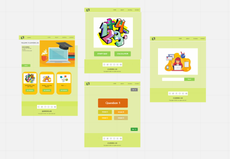
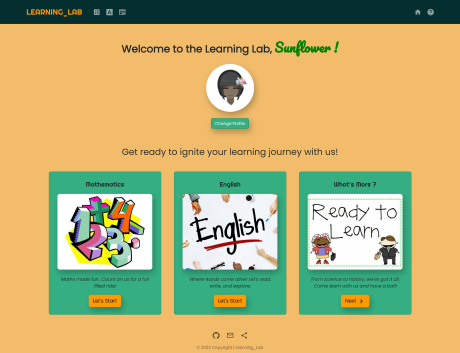
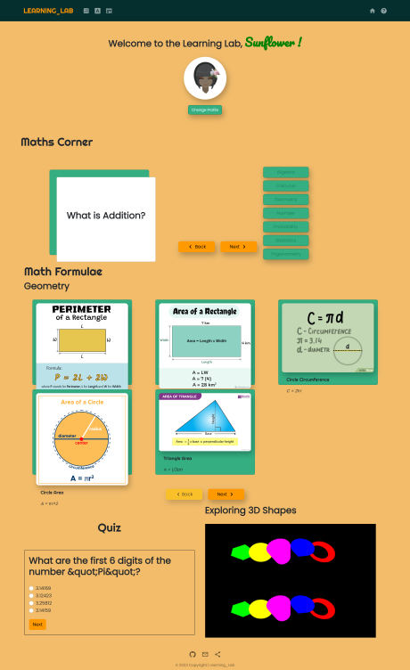
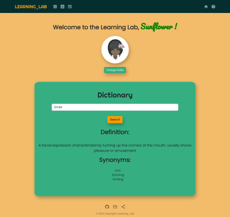
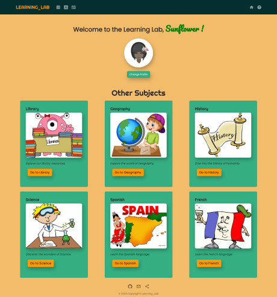

# The Learning_Lab

 [](https://app.netlify.com/sites/thelearninglab-resilient-sunflower/deploys)


## Description

The Learning Lab is an educational platform for children that aims to make learning fun and engaging. The platform currently covers three subjects: Maths, Reading, and vocabulary, and utilizes APIs such as Trivia API, Open Library API, and Word API to provide content for the users.


## Table of Contents

  - [User Story](#user-story)
  - [Acceptance Criteria](#acceptance-criteria)
  - [Technologies Used](#technologies-used)
  - [Installation](#installation)
  - [Usage](#usage)
  - [License](#license)
  - [Challenges](#challenges)
  - [Successes](#successes)
  - [Future Development](#future-development)
  - [Contributing](#contributing)
  - [Screenshots](#screenshots)
  - [Video](#video)
  - [License](#license)  


## User Story

 ```As a child, I want to learn new things in a fun and interactive way, so that I can enjoy the process of learning and remember what I've learned.```

## Acceptance criteria

The Learning Lab should meet the following criteria:
* The platform should have a home page with links to different subjects available for learning.
* The Maths section should present users with questions and answer options, and provide feedback on whether the answer was correct or incorrect.
* The English section should provide users with a search bar so that they can look up definitions, synonyms and a random word so that users can expand their vocabulary, sourced from the Word API.
* The Learn More section takes users to explore another page with a library amd other subjects. The Library section should allow users to borrow books to read or just listen. Users should also be able to write a review and make notes. Open Library API should display relevant results. 
* The journal page should allow users to create notes and save them locally on their device.
* The avatar selector should allow users to choose an avatar to represent them on the platform, and display their selected avatar and name throughout the site.
* The platform should be responsive and accessible on multiple devices and screen sizes.

## Technologies Used

* React: a JavaScript library for building user interfaces
* React Router: a library for handling routing in a React application
* Axios: a JavaScript library for making HTTP requests
* Bootstrap: a CSS framework for building responsive and mobile-first websites
* Open Library API: an open-source API for searching and retrieving book data
* Word API: an API for retrieving word definitions, synonyms, and other related information
* Trivia API: an API for retrieving trivia questions and answers
* Material UI
* React Spinner
* Maths.js
* Moment.js
* ThreeJS
* CSS

* Trello, Slack and Zoom for project management and communication

## Installation

To access the deployed version of this project, simply visit the following URL: 
- https://thelearninglab-resilient-sunflower.netlify.app/

If you'd like to make changes to the project and deploy your own version, you can follow these steps:

1. Clone this repository to your local machine using the command git clone https://github.com/JosephNamihas/Learning-Lab.git
2. Navigate to the project directory in your terminal using the command cd your-project.
3. Install the required dependencies by running the command npm install.
4. Deploy the project to Netlify using the command npm run build.
5. Follow the prompts in the terminal to connect your project to Netlify.
Once the deployment process is complete, you can access the deployed version of your project at the URL provided by Netlify.
Note that you'll need to have a Netlify account and have set up a site on Netlify in order to deploy your project using this method.

## Usage

Once the app is running, you can access it by opening a web browser and navigating to http://localhost:3000/. From there, you can use the navigation links to explore the different subjects available for learning. The Maths, English, and Learn more sections each have their own pages with interactive features. The Journal and Avatar Selector pages are accessible from the (navigation) bar at the top of the screen. Enjoy learning and taking notes with The Learning_Lab!

## Challenges

- Netlify could be difficult at times; Builds would often fail and the logs were not always helpful. With a bit of research, we managed to fix it by adding a _redirect file to the root of the project. After implementing this, the build was succesfull. 


## Successes

- A well organised team! We had two minor git merge conflicts. I believe this was partly due to how well we organised the workload. Even towards the end of the project when we were working on the same files, we always communicated well to make sure no conflicts would likely occur.

- We settled on our application idea before the first project lesson. We all wanted to do something educational, and while that changed slightly after initial plans, we were all passionate about what we were creating


## Future Development

* Add more content to make our website accessible to learners from Early Years to KS4.
* Cater to the needs of our dedicated educators with a dedicated teacher domain for personalized assignments, group management, and tailor-made resources for easy planning and downloads.
* Integrate the learning platform with popular LMS systems used by schools, such as Blackboard or Canvas, in addition to a dedicated teacher domain.
* Create domains for schools to have their own personal account. This will help teachers select appropriate topics for special groups of students based on their interests and learning style, using data from quizzes and other assessments.
* Translate scores on quizzes and time spent learning into rewards based on the school's behavior policy, such as house points, merits, and badges, to encourage engagement and motivation.
* Enhance the platform's offerings and appeal to a wider range of learners by incorporating more interactive content, such as simulations, games, and videos.
* Expand the selection of books by adding more authors to enhance the platform's offerings and appeal to a wider range of learners.


## Contributing

Augustine - ```"Collaborating on this web project alongside passionate and innovative team members has been an incredibly inspiring journey. It's heartening to see that our conversations throughout the app's development were centered on enriching the user experience. As a result, we've created a product that is not only user-friendly and intuitive but also aesthetically pleasing" ```

Suzie - ``` "For this project, I would say that I really enjoyed working with the team. We planned well and kept communicating throughout the project, we came across many challenges but we did manage to get our project done nicely. It was a pleasure to work with you all. Thank you team 😊" ```

Jenelle - ```"I feel immensely grateful for the opportunity to be a part of this amazing team that developed the Learning_Lab. It was an incredible experience working with some of the best in the field. From planning to creating to deployment, I had a lot of fun while learning and growing."```

Joe - ```"It was great working with this team. We had a plan from day one and executed it efficently and with plenty of time to spare. We all agreed on the principle of the app and managed to build and implement the features as we went along."  ```


## Credits

- Miss Anissa Spio-Garbrah for letting us use some of her art work for our Login Avatars.


## Screenshots
### Wire frame using Miro: 


### Home page:


### Maths page:


### Word page:


### And more:


## Video


## License

MIT License

Copyright (c) 2023 Joseph Namihas | Augustine Farinola | Sorada Wright | Jenelle Spio-Garbrah

Permission is hereby granted, free of charge, to any person obtaining a copy
of this software and associated documentation files (the "Software"), to deal
in the Software without restriction, including without limitation the rights
to use, copy, modify, merge, publish, distribute, sublicense, and/or sell
copies of the Software, and to permit persons to whom the Software is
furnished to do so, subject to the following conditions:

The above copyright notice and this permission notice shall be included in all
copies or substantial portions of the Software.

THE SOFTWARE IS PROVIDED "AS IS", WITHOUT WARRANTY OF ANY KIND, EXPRESS OR
IMPLIED, INCLUDING BUT NOT LIMITED TO THE WARRANTIES OF MERCHANTABILITY,
FITNESS FOR A PARTICULAR PURPOSE AND NONINFRINGEMENT. IN NO EVENT SHALL THE
AUTHORS OR COPYRIGHT HOLDERS BE LIABLE FOR ANY CLAIM, DAMAGES OR OTHER
LIABILITY, WHETHER IN AN ACTION OF CONTRACT, TORT OR OTHERWISE, ARISING FROM,
OUT OF OR IN CONNECTION WITH THE SOFTWARE OR THE USE OR OTHER DEALINGS IN THE
SOFTWARE.
